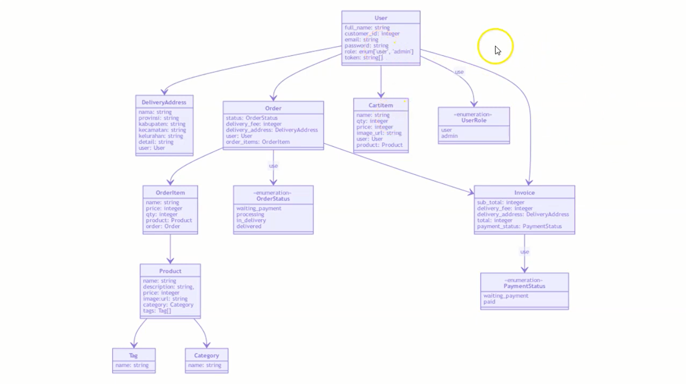

<div id="top"></div>

<!-- PROJECT LOGO -->
<br />
<div align="center">
  <a href="https://github.com/alfaniferdiansah/studycase-backend">
    
  </a>

<h3 align="center">E-Commerce Tech</h3>

</div>

<!-- ABOUT THE PROJECT -->

## About The Project

E-commerce Tech is a modern application for selling a daily technology. We have some product tech to sell with best price and new product, user can order product what they want to buy and will received an invoice will to inform process order

<p align="right">(<a href="#top">back to top</a>)</p>

## Design Database

<div align="center">
  <a href="https://github.com/alfaniferdiansah/studycase-backend">
    
  </a>

<h3 align="center">E-Commerce Tech</h3>

</div>

### Built With

- [node.js](https://nodejs.org/)
- [express.js](https://expressjs.com/)
- [mongoDB](https://www.mongodb.com/)

<p align="right">(<a href="#top">back to top</a>)</p>

<div id=package></div>

### Using Package

<ol>
<li>*. ["@casl/ability](https://www.npmjs.com/package/@casl/ability)</li>
<li>*. [bcryptjs](https://www.npmjs.com/package/bcryptjs)</li>
<li>*. [cookie-parser](https://www.npmjs.com/package/cookie-parser)</li>
<li>*. [cors](https://www.npmjs.com/package/cors)</li>
<li>*. [dotenv](https://www.npmjs.com/package/dotenv)</li>
<li>*. [express-validator](https://www.npmjs.com/package/express-validator)</li>
<li>*. [http-errors](https://www.npmjs.com/package/http-errors)</li>
<li>*. [jsonwebtoken](https://www.npmjs.com/package/jsonwebtoken)</li>
<li>*. [mime](https://www.npmjs.com/package/mime)</li>
<li>*. [mongoose](https://www.npmjs.com/package/mongoose)</li>
<li>*. [mongoose-sequence](https://www.npmjs.com/package/mongoose-sequence)</li>
<li>*. [morgan](https://www.npmjs.com/package/morgan)</li>
<li>*. [multer](https://www.npmjs.com/package/multer)</li>
<li>*. [passport](https://www.npmjs.com/package/passport)</li>
<li>*. [passport-jwt](https://www.npmjs.com/package/passport-jwt)</li>
<li>*. [passport-local](https://www.npmjs.com/package/passport-local)</li>
<li>*. [nodemon](https://www.npmjs.com/package/nodemon)</li>
</ol>

<p align="right">(<a href="#top">back to top</a>)</p>

<!-- GETTING STARTED -->

## Getting Started

This is an example of how you may give instructions on setting up your project locally.
To get a local copy up and running follow these simple example steps.

### Prerequisites

This is an example of how to list things you need to use the software and how to install them.

- npm
  ```sh
  npm install npm@latest -g
  ```

### Installation

1. Clone the repo
   ```sh
   git clone https://github.com/alfaniferdiansah/studycase-backend.git
   ```
2. Install NPM packages
   ```sh
   npm install
   ```
3. Install NPM packages required <p align="left">(<a href="#package">Get to Package</a>)</p>

<p align="right">(<a href="#top">back to top</a>)</p>